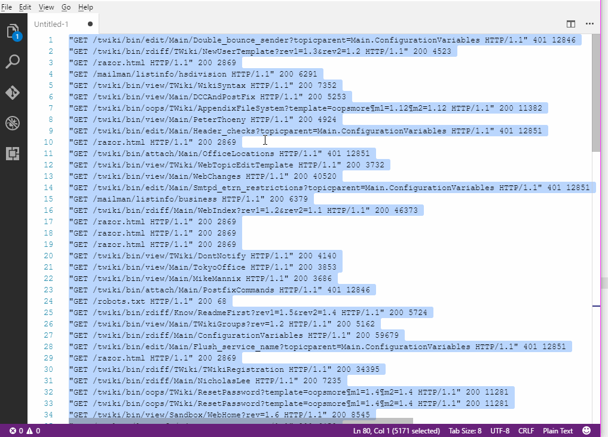

# histogram

Miss your sublime histogram plugin? Easily create frequency histograms using this extension.
Useful for log analysis (e.g. group and count number of errors) and statistics.

## Release Notes

### 0.0.2

Added default key bindings (Alt+F10).

### 0.0.1

Initial release

**Enjoy!**
